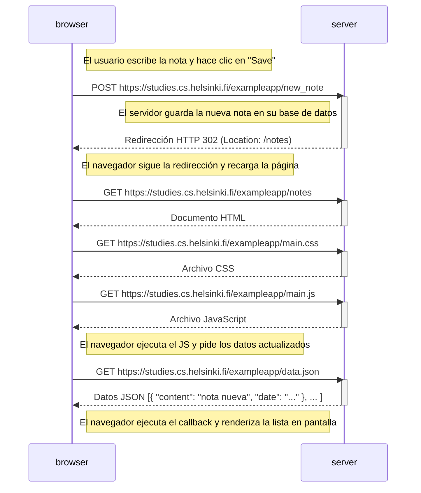

```mermaid
sequenceDiagram
    participant browser
    participant server

    Note right of browser: El usuario escribe la nota y hace clic en "Save"

    browser->>server: POST https://studies.cs.helsinki.fi/exampleapp/new_note
    activate server
    Note left of server: El servidor guarda la nueva nota en su base de datos
    server-->>browser: Redirección HTTP 302 (Location: /notes)
    deactivate server

    Note right of browser: El navegador sigue la redirección y recarga la página

    browser->>server: GET https://studies.cs.helsinki.fi/exampleapp/notes
    activate server
    server-->>browser: Documento HTML
    deactivate server

    browser->>server: GET https://studies.cs.helsinki.fi/exampleapp/main.css
    activate server
    server-->>browser: Archivo CSS
    deactivate server

    browser->>server: GET https://studies.cs.helsinki.fi/exampleapp/main.js
    activate server
    server-->>browser: Archivo JavaScript
    deactivate server

    Note right of browser: El navegador ejecuta el JS y pide los datos actualizados

    browser->>server: GET https://studies.cs.helsinki.fi/exampleapp/data.json
    activate server
    server-->>browser: Datos JSON [{ "content": "nota nueva", "date": "..." }, ... ]
    deactivate server

    Note right of browser: El navegador ejecuta el callback y renderiza la lista en pantalla
```
