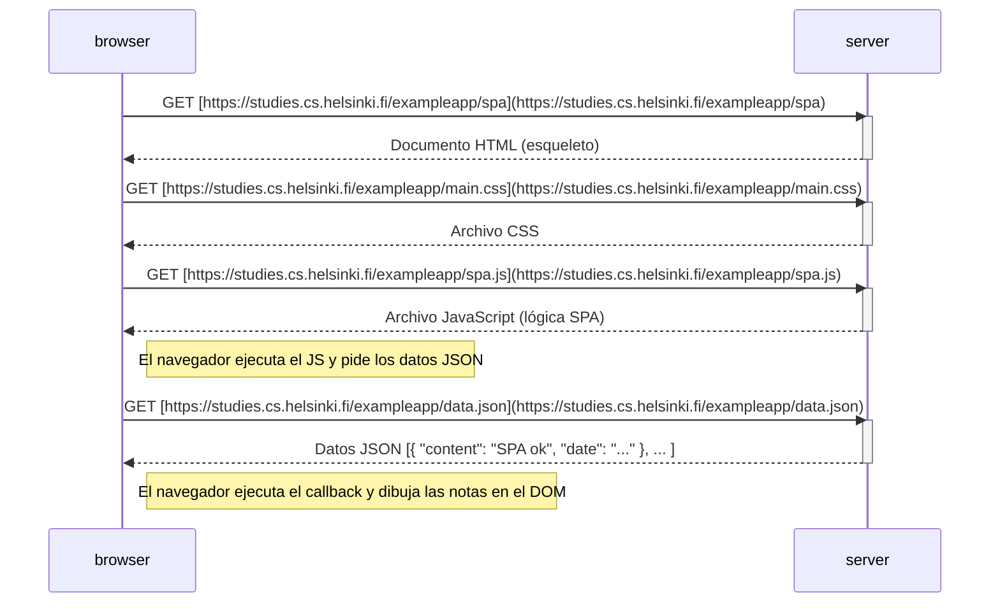

```mermaid
sequenceDiagram
    participant browser
    participant server

    browser->>server: GET [https://studies.cs.helsinki.fi/exampleapp/spa](https://studies.cs.helsinki.fi/exampleapp/spa)
    activate server
    server-->>browser: Documento HTML (esqueleto)
    deactivate server

    browser->>server: GET [https://studies.cs.helsinki.fi/exampleapp/main.css](https://studies.cs.helsinki.fi/exampleapp/main.css)
    activate server
    server-->>browser: Archivo CSS
    deactivate server

    browser->>server: GET [https://studies.cs.helsinki.fi/exampleapp/spa.js](https://studies.cs.helsinki.fi/exampleapp/spa.js)
    activate server
    server-->>browser: Archivo JavaScript (lógica SPA)
    deactivate server

    Note right of browser: El navegador ejecuta el JS y pide los datos JSON

    browser->>server: GET [https://studies.cs.helsinki.fi/exampleapp/data.json](https://studies.cs.helsinki.fi/exampleapp/data.json)
    activate server
    server-->>browser: Datos JSON [{ "content": "SPA ok", "date": "..." }, ... ]
    deactivate server

    Note right of browser: El navegador ejecuta el callback y dibuja las notas en el DOM
```