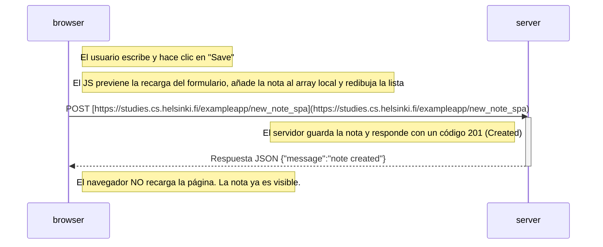

```mermaid
sequenceDiagram
    participant browser
    participant server

    Note right of browser: El usuario escribe y hace clic en "Save"
    Note right of browser: El JS previene la recarga del formulario, añade la nota al array local y redibuja la lista

    browser->>server: POST [https://studies.cs.helsinki.fi/exampleapp/new_note_spa](https://studies.cs.helsinki.fi/exampleapp/new_note_spa)
    activate server
    Note left of server: El servidor guarda la nota y responde con un código 201 (Created)
    server-->>browser: Respuesta JSON {"message":"note created"}
    deactivate server

    Note right of browser: El navegador NO recarga la página. La nota ya es visible.
```